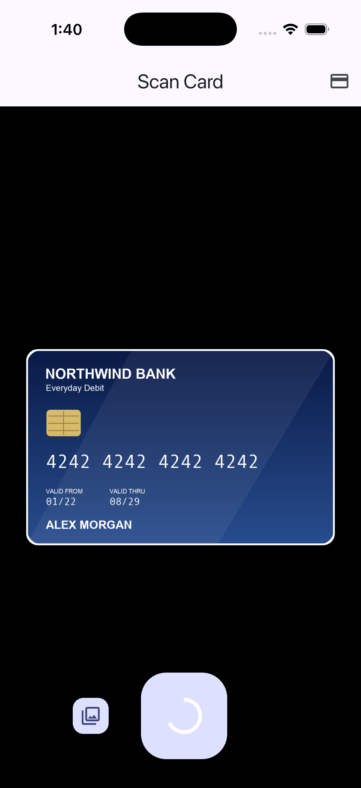
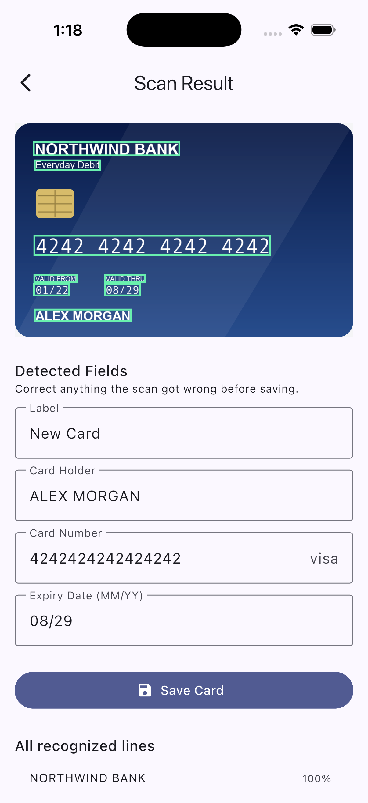
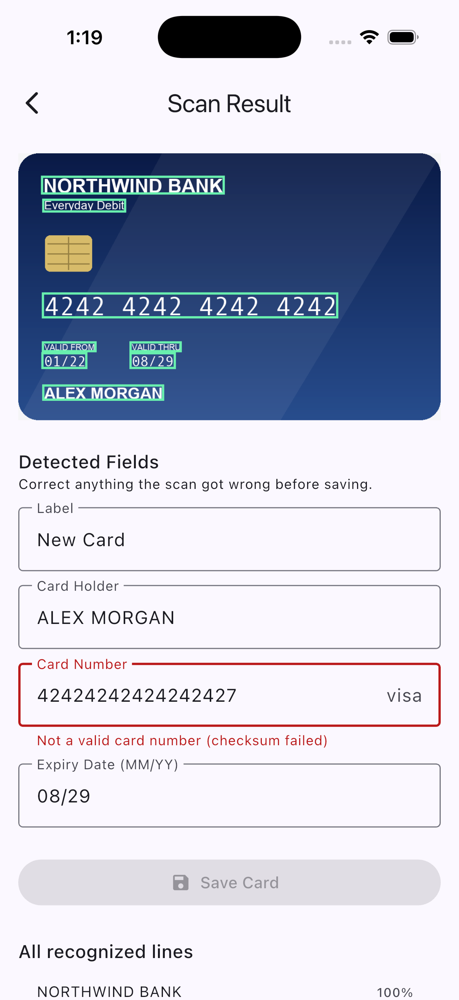
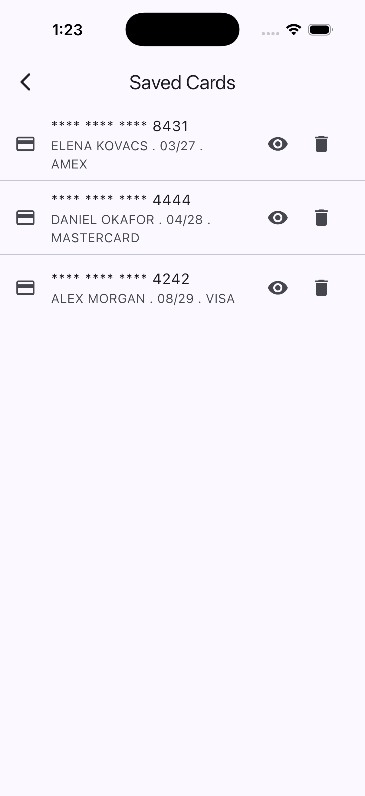
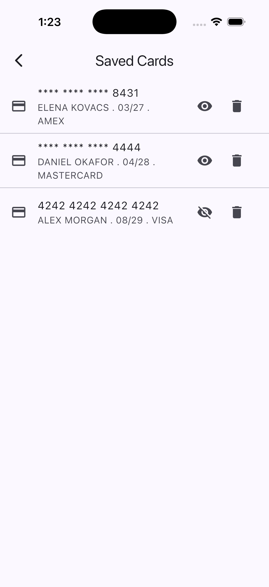
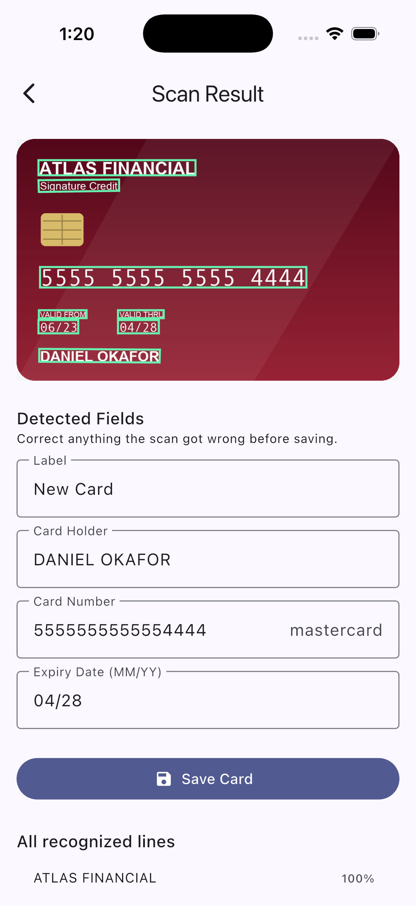

# cardOCR

Scan a debit or credit card with your phone and get its fields back as
structured, editable data — then store it encrypted on the device.

A Flutter app talks over HTTPS to a small local FastAPI service running
**PaddleOCR**. The phone captures (or imports) the card image; the service
returns every recognized text line with its bounding box and confidence; the
app turns those into a card number, expiry, cardholder name and network, lets
you correct anything the scan got wrong, and saves the result under AES-256-GCM.

```
[ iPhone ]                                    [ Mac ]
camera / library ──► JPEG bytes ──HTTPS──►  FastAPI  ──►  PaddleOCR
                                                             │
   boxes + fields  ◄────────── JSON ◄────────────────────────┘
        │
   review & edit ──► AES-256-GCM ──► sqflite (ciphertext only)
```

---

## Screenshots

<table>
<tr>
<td width="33%"></td>
<td width="33%"></td>
<td width="33%"></td>
</tr>
<tr>
<td><b>Capture</b><br>Everything outside the card cutout is dimmed. The capture
is cropped to that cutout before upload — so the backend never wastes time
reading text behind the card — and the viewport then freezes on those exact
cropped pixels. What you see is literally what the OCR engine is reading.</td>
<td><b>Detection</b><br>Every recognized line is outlined on the photo, colored
by confidence (green ≥ 0.9, amber ≥ 0.7, red below). Note it picked
<code>08/29</code> from <b>VALID THRU</b>, not <code>01/22</code> from
<b>VALID FROM</b>.</td>
<td><b>Validation</b><br>The card number is checked against the Luhn algorithm
as you type. Break a digit and the field goes red and <b>Save</b> disables —
which matters, because embossed digits are the hardest thing on a card to
read.</td>
</tr>
</table>

<table>
<tr>
<td width="33%"></td>
<td width="33%"></td>
<td width="33%"></td>
</tr>
<tr>
<td><b>Saved cards</b><br>Masked by default — the database holds nothing but
ciphertext, and the list never shows a full number on its own.</td>
<td><b>Tap to reveal</b><br>One card at a time, decrypted in memory only.
Tapping another closes this one.</td>
<td><b>Any network</b><br>Visa, Mastercard and Amex are identified from the IIN
prefix of the number itself, never from a logo.</td>
</tr>
</table>

> Screenshots use the synthetic cards in
> [`card_ocr_server/sample_cards/`](card_ocr_server/sample_cards) — invented
> banks, invented names, and publicly documented payment *test* card numbers.
> No real card appears anywhere in this repository.

---

## Repository layout

| Path | What it is |
|---|---|
| [`card_ocr/`](card_ocr) | The Flutter app |
| [`card_ocr_server/`](card_ocr_server) | The Python OCR backend — [setup and API docs](card_ocr_server/README.md) |
| [`card_ocr_server/sample_cards/`](card_ocr_server/sample_cards) | Synthetic test cards, safe to commit and share |
| `docs/screenshots/` | The images above |

---

## How the fields are extracted

The OCR service returns unordered text lines. Turning those into a card takes
a few rules that are easy to get wrong:

- **Card number** — OCR frequently splits the number across several boxes
  (`"4242"`, `"4242"`, `"4242 4242"`). So candidate digit runs are accumulated
  and tested against the **Luhn checksum** after each addition; the first
  13–19 digit sequence that passes wins. The checksum is what makes this safe
  to do greedily.
- **Expiry** — cards print **both** VALID FROM and VALID THRU. Reading the
  labels is unreliable (that text is small and low-contrast — on one real card
  it OCR'd as `"VAUIG OO0"`), so every `MM/YY` on the card is collected and the
  **chronologically latest** is taken. Valid-thru is later than valid-from by
  definition.
- **Cardholder** — the longest all-caps line is the wrong heuristic:
  `NORTHWIND BANK` beats `ALEX MORGAN` on length. Position is reliable instead —
  issuer and product names are printed at the top, the cardholder name at the
  bottom — so the lowest matching line on the card wins.
- **Network** — from the IIN prefix of the number (`4` → Visa, `51`–`55` and
  `2221`–`2720` → Mastercard, `34`/`37` → Amex).

Every one of these is a guess, which is why the result screen is an editable
form rather than a confirmation dialog.

---

## Security

- **The CVV is never captured or stored.** There is no field for it anywhere in
  the data model, and only the front of the card is ever photographed.
- **Card numbers are encrypted at rest** with AES-256-GCM. The key is generated
  on first launch and lives in the iOS Keychain / Android Keystore via
  `flutter_secure_storage` — never in the database beside the ciphertext.
- **The database holds ciphertext only.** Extracting the sqflite file from the
  device yields nothing readable.
- **The server persists and logs nothing.** Images are decoded in memory and
  discarded; OCR results are never printed or written to disk.
- **Transport is HTTPS even on localhost**, using a locally-trusted `mkcert`
  certificate rather than plain HTTP.

---

## Architecture

Clean Architecture with `flutter_bloc`. Dependencies point inward only:

```
presentation  ──►  domain  ◄──  data
   Cubits            entities      models + json_serializable
   screens           use cases     dio datasource  ──► FastAPI
   painters          repo interfaces
                     card rules     crypto + sqflite datasource
```

`domain/` imports nothing external — no Flutter, no `dio`, no `sqflite`, not
even the DI annotations (use cases are registered through an explicit
`@module` so the layer stays clean). That is what kept swapping the HTTP
client, and later fixing TLS trust, to single-file changes.

Wiring is `get_it` + `injectable`; state is Cubits throughout, with **no
`setState` anywhere** — resource lifecycles that would normally need a
`StatefulWidget` (the camera controller, the edit form's text controllers) live
in a Cubit and are released in its `close()`.

---

## Running it

1. Start the backend — see [`card_ocr_server/README.md`](card_ocr_server/README.md)
   for the venv, certificate and `uvicorn` details.
2. Open the repo in VS Code and run the **Full stack (server + device)**
   compound from the Run and Debug panel, or:

```bash
cd card_ocr
flutter run --dart-define=OCR_BASE_URL=https://<your-mac-hostname>.local:8000
```

The backend URL is never hardcoded — it is injected per launch configuration
and read via `String.fromEnvironment`.

**On a simulator** there is no camera, so use the **import from library**
button beside the shutter. Load the sample cards in first:

```bash
xcrun simctl addmedia booted card_ocr_server/sample_cards/*.png
xcrun simctl keychain booted add-root-cert "$(mkcert -CAROOT)/rootCA.pem"
```
